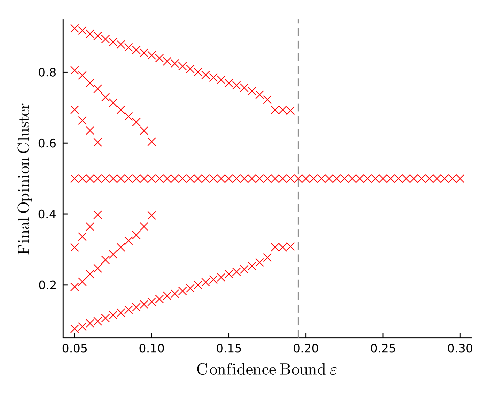
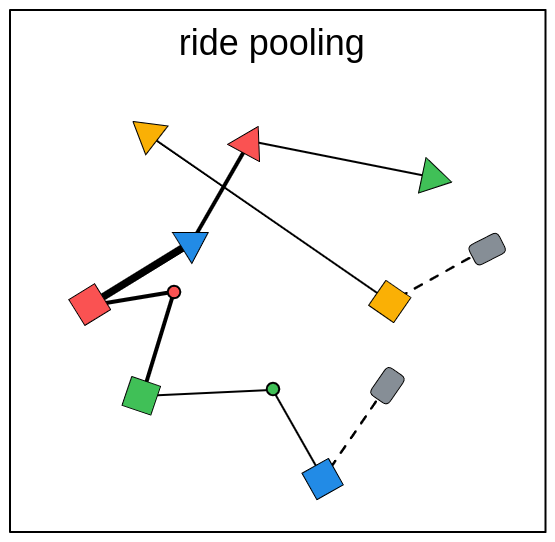

Individual cars are still a vital part of modern society transportation. Nevertheless, they are also a considerable contributor to air pollution, exploitation of natural resources and traffic congestion.
The emerging transport mode of ride pooling combines the journeys of multiple users into a single on-demand bus. Thus it could mitigate the negative impact of individual transportation on the environment and the society.

  
  
  <em>Ride pooling combines multiple journeys into a single on-demand bus.</em>

Most existing studies on ride pooling simulate it in great details while trying to be as realistic as possible and consequently, the causal relation between model input and output is blurred. 
However, a profound understanding of the system would be indispensable for a successful implementation.

In my thesis, I thus aim to break ride pooling dynamics down to its most essential features and develop a simplified model of ride pooling. 
For this purpose, the complex dynamics are projected onto a single variable representing the state of the system:
the bus occupancy and how it changes over time.
This reduces the high-dimensional simulation space to a one-dimensional perspective without access to any instantaneous information about the spatial configuration of the system. 
Accordingly, a generic modeling framework is presented that is kept as simple as possible and which can predict both statistical information and dynamic behavior of the variable bottom-up.

Applying the framework to a simple ride pooling system, it provides very accurate results for the bus occupancy statistics and predicts the dynamics reasonably precise, while being modular in design and by this remaining adaptable to many different setups. 
For instance, the geometry of the map is fed directly into the model and eventually, using the proposed framework, the quality of the map for ride pooling systems could be evaluated without the need of running high-dimensional agent-based simulations on said map.
